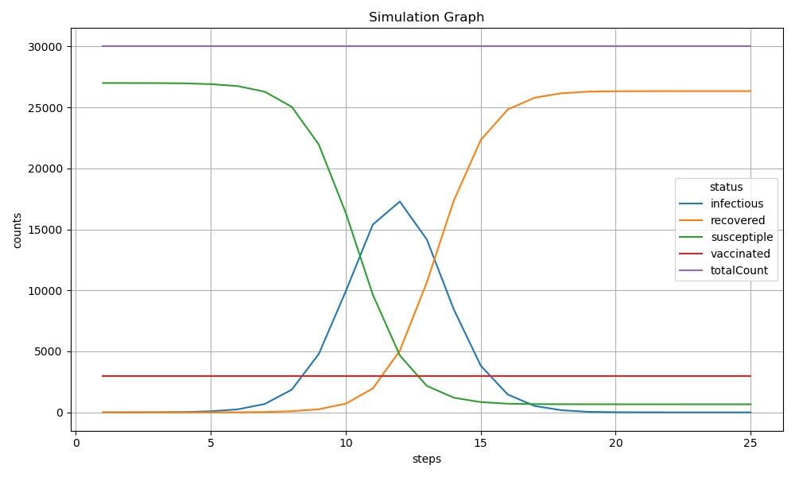
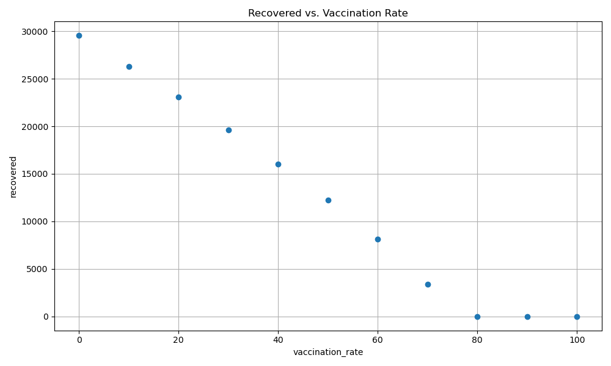

# Infectious Disease Simulation

This project simulates the spread of an infectious disease through a population over time, using simple C++ classes and configuration files.

## 🗂 Project Structure

```
project-root/
├── build/
│   └── ...
├── configExample/
│   └── disease_in.ini
├── examples/
│   ├── deterministic/
│   │   └── disease_in.ini
│   └── single_population/
│       └── disease_in.ini
├── include/
│   ├── doctest.h
│   └── INIReader.h
├── report_data/
│   ├── disease_details.csv
│   ├── disease_stats.csv
│   ├── final_plot.png
│   ├── Recovered_vs._Vaccination_Rate.png
│   ├── part_1_disease_simulation.pdf
│   └── report_data.rar
├── simulation/
│   ├── Disease.cpp / .h
│   ├── Person.cpp / .h
│   ├── Population.cpp / .h
│   ├── simulation.cpp / .h
│   ├── main.cpp
│   ├── test.cpp
│   ├── test_disease.cpp
│   ├── test_person.cpp
│   ├── test_population.cpp
│   └── test_touch.cpp
├── plot_simulation.py
├── vaccination_curve.py
├── Dockerfile
└── README.md              
```

## 🧪 How to Run the Simulation

### 1. Compile the Project
```bash
cd part_1_disease
mkdir build
cd build
cmake ..
make
```

### 2. Run the Simulation
```bash
./main_exec
```
> This will use the `disease_in.ini` file inside the `configExample` folder.

### 3. Check the Output
- `report_data/disease_details.csv`: detailed daily stats for each simulation run
- `report_data/disease_stats.csv`: summary stats for each simulation run

## 🐳 Docker Support

You can also build and run the simulation using Docker:

```bash
sudo docker build -t part_1_disease .
sudo docker run -v "$(pwd)/configExample:/configExample" part_1_disease
```

This will compile and execute the simulation and all tests in a clean environment.

## 📊 Generate Graphs

Make sure Python 3 is installed, then install required libraries:
```bash
pip3 install matplotlib pandas
```

### 1. Plot Infection Curve Over Time
```bash
python3 plot_simulation.py
```

### 2. Plot Recovered vs. Vaccination Rate
```bash
python3 vaccination_curve.py
```

Both scripts will save plots in `report_data/`.

## 🖼️ Example Output

  


## ⚙️ Parameters Used
- Duration (D): 4
- Contacts per day (C): 6
- Transmission Probability (β): 0.2
- Vaccination rate: 0.1
- Population size: 30000

## 📄 Report

You can find the full report and results in the `report_data/` folder:
- `part_1_disease_simulation.pdf`: Final report (PDF)
- `report_data.rar`: Compressed archive including report and plots

## 👨‍💻 Author  
*Mohamed Mahmoud Helmy Mohamed Hamed Mohamed*  
Email: mohamed.mohamed2@stud.th-deg.de  
Matriculation Number: 12503239
