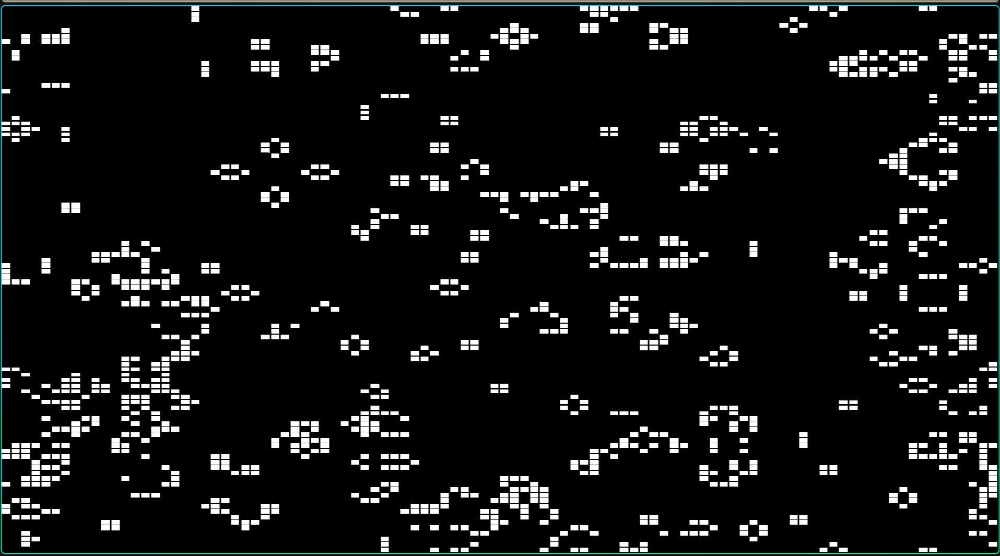
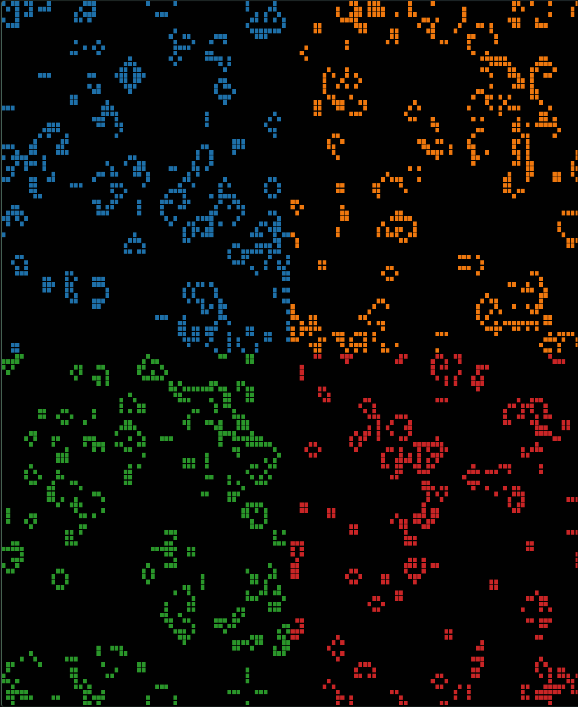

# Game Of Life

## Compile 

The CMakeLists.txt will pull and build the GUI library (SFML) from source. This requires the
installation of all dependencies via: 

```
sudo apt update
sudo apt install \
    libxrandr-dev \
    libxcursor-dev \
    libxi-dev \
    libudev-dev \
    libfreetype-dev \
    libflac-dev \
    libvorbis-dev \
    libgl1-mesa-dev \
    libegl1-mesa-dev \
    libfreetype-dev \ 
    libeigen3-dev \
    openmpi-bin \
    libopenmpi-dev
```


Then: 

```
mkdir build && cd build
cmake .. 
make
```

It is possible to enable debugging output using 

```
mkdir build && cd build
cmake -DENABLE_DEBUG=on .. 
make
```

Be aware that debugging information is printed to the terminal and should not be
used with large grids (>128 rows/cols). The suggested debugging run is using a 
16 by 16 grid.

``` 
mpirun -n 1 ./game_of_life -c 16 -r 16 -i 5 
```

The binary `game_of_life` will be created and can be executed to run the simulation.

## Run the Simulation 

Locate the `game_of_life` binary and start it using `./game_of_life`. Without additional 
configuration it will open a GUI window and run the simulation.

When the simulation is done or stopped, it will write the last state to a file called 
`output.txt`. 



## How to Use the Game of Life GUI

The Game of Life GUI provides an interactive experience where you can control the state of the game through keyboard inputs. Below are the available controls and their corresponding actions:

### Controls

- **Close Window**
  - Press the `Close` button of the window or the `Escape` key to exit the application. 
  This will write the final state to `output.txt`.

- **Adjust Frame Rate**
  - **Increase Frame Rate**: Press the `Up Arrow` key to increase the frames per second (FPS) limit by 5. The maximum FPS limit is 120.
  - **Decrease Frame Rate**: Press the `Down Arrow` key to decrease the FPS limit by 5. The minimum FPS limit is 1.

## Command-Line Interface Documentation

This application can be run with several command-line options to customize its behavior. Below are the available options and their descriptions.

### Usage

```shell
./game_of_life [options]
```

### Options
- `-n`, `--no-ui`: Run the program without the user interface. By default, the UI is enabled. Use this option to disable it.
- `-r <global_rows>, --global_rows <global_rows>`: Specify the number of global_rows in the grid. If this option is not provided, the default value is `124`. Grid values must be a power of 2.
- `-c <global_cols>, --global_cols <global_cols>`: Specify the number of columns in the grid. If this option is not provided, the default value is `124`. Grid values must be a power of 2.
- `-i <iterations>, --iterations <iterations>`: Set the number of iterations the program should run. The default is `-1`, which denotes infinite iterations.
- `-f <filename>, --file <filename>`: Load the initial state from a specified file. Note that
  you are required to provide the dimensions (`-r`, `-c`), they are not read from the file!
- `--show-grid`: Enable grid display. This is a boolean toggle flag; specifying it enables the grid display. By default, grid display is disabled.
 
### Examples

- To run the application without the UI (for example for a parallel MPI run):

  ```shell
  mpirun -n 4 ./game_of_life -n
  ```

- To specify grid dimensions of 256 global_rows and 256 columns:

  ```shell
  ./game_of_life -r 256 -c 256
  ```

- To run the application for a fixed number of 30 iterations:

  ```shell
  ./game_of_life -i 30
  ```

- To start the application with an initial state from a file:

  ```shell
  ./game_of_life -f initial_state.txt
  ```
  
## Debugging and Development 

When using the `--show-grid` option, the MPI grid will be indicated in the UI by 
different colors per process. When MPI communication is implemented correctly,
cells will move seamlessly beyond the borders of each cell.




## File Format for Game of Life Grid

The Game of Life grid is stored in a plain text file format with the following specifications:

- Each line in the file represents a row in the grid.
- Each character in a line corresponds to a cell in the grid, with the following interpretations:
  - `'1'`: Represents a live cell.
  - `'0'`: Represents a dead cell.
  - Any other character is also interpreted as a dead cell.
- The number of lines in the file defines the number of global_rows, and the number of characters in each line defines the number of columns in the grid.

## Common Patterns

The script `scripts/generate_patterns.py` can generate common patterns for testing. See `scripts/README.md` for usage.
